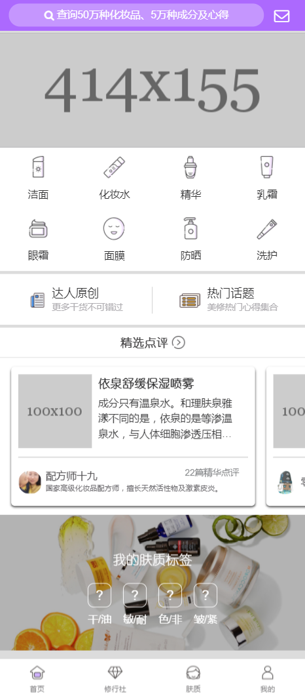
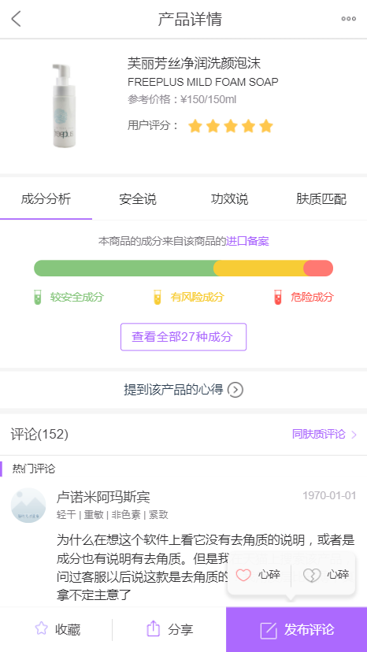

# Bevol

基于Vue高仿美丽修行。

__技术栈__

* vue
* vue-router
* vuex
* axios
* webpack
* http-proxy-middleware
* muse-ui

## 运行

```bash
cd my-project
```
```bash
npm init       --加载依赖
```
```bash
npm run dev    --开启本地dev服务器
```
## 预览

<p align="center">
  <br>
  
  <br>
  <br>
  
  <br>
</p>

### 关于跨域

为了获取真实的用户数据，我使用node做反向代理获取post请求的数据。或者用jsonp也可以，不过jsonp只能获取get请求的数据。类似于登陆、注册之类的接口，需要token，这部分数据获取不到，所以登录部分只是做了个假的界面。

项目里面请求的图片都是是存在阿里的oss上的，设置了请求限制，所以有些请求不到。本地开发的时候可以在浏览器中打开图片链接，然后就能从缓存里读图片。

By the way,用 ```$ vue cli```生成的模板,在本地开发时可以在config文件夹下的index.js里配置proxyTable来进行跨域。

### UI框架选择

其实大部分的UI都是纯手写，有些地方用到了muse-ui。个人感觉，不管是从样式，动画，还是官方文档上来说muse-ui在vue生态中都是顶尖的存在。

__完成的功能__

* 首页
* 修行社
* 肤质
* 我的
* 搜索
* 产品搜索
* 话题列表
* 产品列表
* 产品详情
* 肤质详情

## PWA (Progress Web Application) 实践
谷歌的chrome团队提出pwa，旨在提升web应用的安全性，稳定性，和用户体验。在提升用户体验上提出了PPRL原则。即preload、precache、render、lazyout。

* preload实践，在首页加载完成后根据数据埋点找到用户最有可能访问的下一个页面，提前加载数据储存到vuex中。
* precache，precache需要service worker的支持，把数据缓存在service worker中，可以减少请求次数并实现秒加载，尚在研究。
* render实践，用app shell（骨架屏）代替loader，使页面尽快地呈现给用户。骨架屏是一段纯html和css，在慢网或者无网的情况下用户的体验更好。增加app的停留时间。
* lazyout实践，懒加载不用多说，用到才去请求数据，减少首屏渲染时间。

__待完成的功能__

* 登陆，注册（这个要传md5生成的一个token,真心不好搞）
* 肤质测试题
* 文章详情
* 发布评论

## 结语

我是16年7月开始自学前端，算算都一年多了。在我的成长之路上，不少前辈的博客都给予我极大的帮助，所以抱着回馈社区的心态，写了这个项目。一来，是为了练习vue。二来，也是为了给新人指指路，任何有疑问的地方欢迎issue，我都会第一时间解答。目前是美丽修行前端工程师，由于自身技术在公司得不到充分发挥，想换个工作，有需要的请联系我。（邮箱：535700846@qq.com  微信：18571531064）


